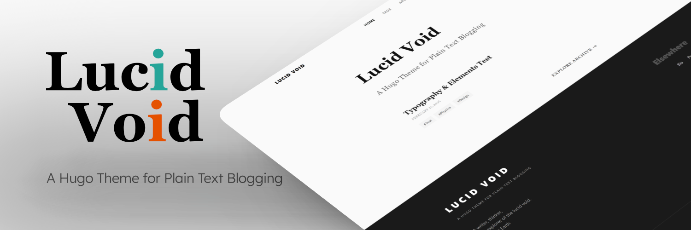
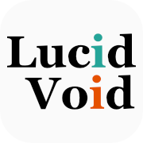

 

# Lucid Void for Hugo



A Hugo theme crafted for plain text blogging. It returns the digital reading experience to its purest essence.

一款专为纯文本博客设计的 Hugo 主题。力求让阅读体验回归其最纯粹的本质。

[English](#english) • [中文](#中文) • [Live Demo](https://hugo-theme-lucidvoid.vercel.app)

---

<h2 id="english">English</h2>

### ✨ The Design Philosophy
The visual framework of this theme is **Lucid Void**, an aesthetic language born from **Lucentia** (the author's personal design laboratory). 

It is primarily inspired by the expansive, spatial navigation paradigms of the classic Metro UI, subtly infused with the tactile depth of Material Design. The theme employs a highly legible, academic-grade serif typography stack over a large area. Set against a strictly monochromatic "void" of black, white, and gray, this quiet foundation allows the user's customizable accent colors to leap out with a lucid vitality.

### 🚀 Core Features
- **Content-First Principle**: Eradicates complex animations and bloated widgets, returning absolute focus to the text.
- **Journal-Grade Typography**: Carefully curated serif typography stack for the main body, delivering an immersive reading experience.
- **Minimalist Taxonomy**: Retains only a flat, networked "Tags" system, completely deprecating the "Categories" function.
- **Native & High Performance**: Pure Vanilla JavaScript with zero bloated dependencies (no jQuery). Smart, on-demand loading for syntax highlighting and Math (KaTeX) engines. Includes a built-in image lightbox and native support for the Giscus comment system.
- **Blazing Fast Search**: Lightweight, client-side local search powered entirely by native JS.

### ⚙️ Installation & Usage
Inside the root folder of your Hugo site, run:
```bash
git submodule add [https://github.com/AstroNomen/hugo-theme-lucidvoid.git](https://github.com/AstroNomen/hugo-theme-lucidvoid.git) themes/lucidvoid
```

---

<h2 id="中文">中文</h2>


### ✨ 设计哲学

本主题的视觉框架采用了 **Lucid Void (清透虚空)** ， 一个脱胎于作者个人设计实验室 Lucentia 的设计语言。

它主要受到经典 Metro UI 充满空间感的导航范式的启发，并适度加入了 Material Design 的触觉深度。主题大面积采用了极具学术感的严肃衬线排版，在一个由黑白灰构成的空白虚空中，让用户自定义的强调色得以有跃然而出的清透感。

### 🚀 核心特性与功能

- **内容至上原则**：摒弃复杂的动效装饰和臃肿小组件，将绝对的焦点还给文字。
- **参考刊物的排版优化**：正文部分采用精心选择的衬线字体栈，提供沉浸式的阅读体验。
- **极简分类学**：仅保留扁平化的网状“标签 (Tags)”系统，去除“分类”功能。
- **原生与高性能**：纯原生 JavaScript，无 jQuery 等臃肿依赖。按需智能加载代码高亮与数学公式 (KaTeX) 引擎。自带简易图片灯箱，支持  Giscus 评论系统
- **极速搜索**：基于原生 JS 实现的轻量化客户端本地搜索功能。

### ⚙️ 安装与使用
在你的 Hugo 站点根目录下执行：
```Bash
git submodule add [https://github.com/AstroNomen/hugo-theme-lucidvoid.git](https://github.com/AstroNomen/hugo-theme-lucidvoid.git) themes/lucidvoid
```

详细配置请参考本仓库 `exampleSite` 文件夹下的 `hugo.toml` 模板。
